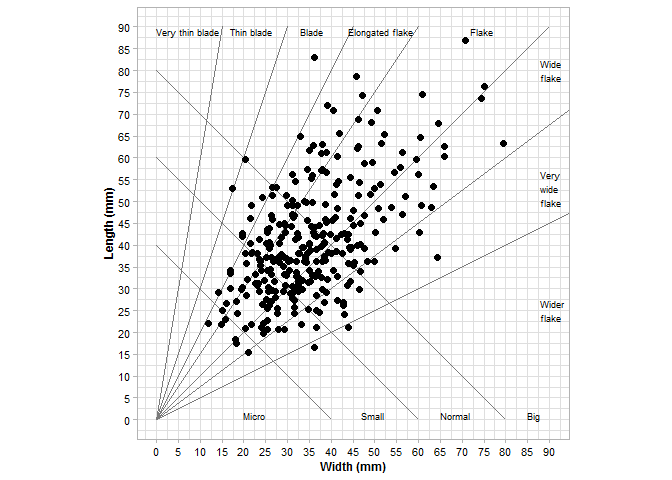
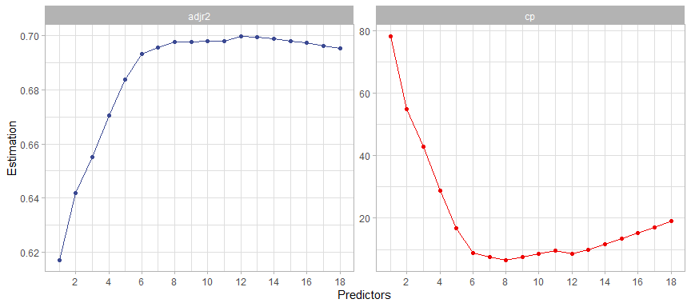
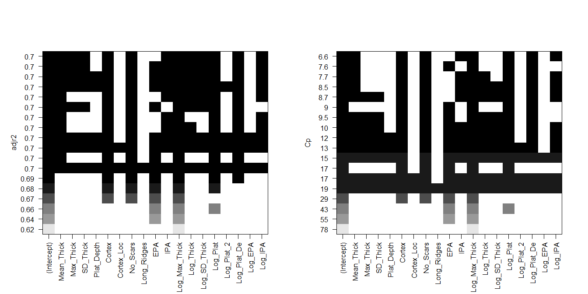
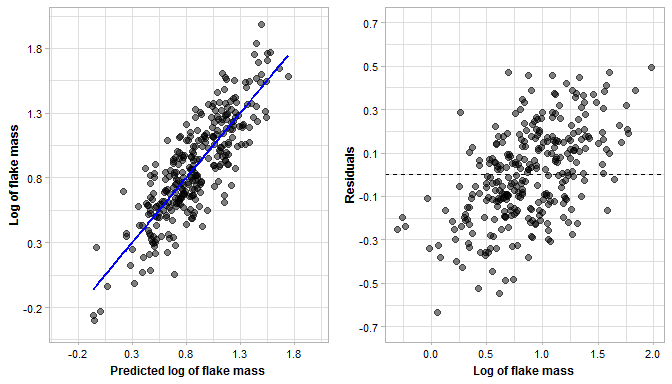
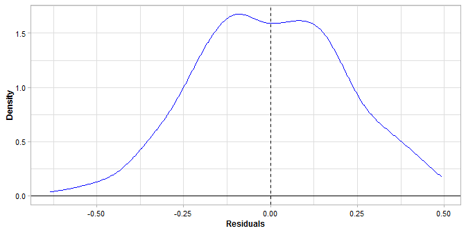
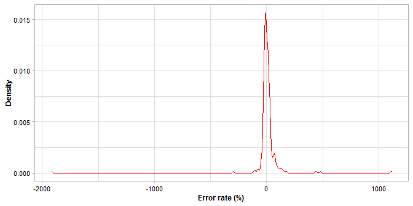

Predicting Flake Mass: A View from Machine Learning. Lithic Technology
================
Guillermo Bustos-Pérez
7/3/2021

## Table of contents

1.  Load packages, read and check data

2.  Descriptive statistics of experimental assemblage  
    2.1) Descriptive statistics  
    2.2) Bagolini scatter plot  
    2.3) Calculation of new variables

3.  Multiple linear regression and best subset selection  
    3.1) Best subset selection  
    3.2) Number of variables  
    3.3) Variable selection

4.  Evaluation of multiple linear regression model  
    4.1) Evaluation metrics  
    4.2) Visual evaluation of model

5.  References

## 1) Load packages, read and check data

The data is available in this repository as a **.csv** file. Please note
that original data uses **“,”** as decimal marker instead of using
**“.”**. Thus, it is required to use the function **read\_csv2**. Data
manipulation and visualization are performed using package **tidyverse**
(Wickham et al., 2019).

``` r
# Load packages  
library(tidyverse)
```

    ## -- Attaching packages ------------------------------------------------- tidyverse 1.3.0 --

    ## v ggplot2 3.3.2     v purrr   0.3.4
    ## v tibble  3.0.3     v dplyr   1.0.2
    ## v tidyr   1.1.2     v stringr 1.4.0
    ## v readr   1.3.1     v forcats 0.5.0

    ## -- Conflicts ---------------------------------------------------- tidyverse_conflicts() --
    ## x dplyr::filter() masks stats::filter()
    ## x dplyr::lag()    masks stats::lag()

``` r
# Read in data
Reg_Data <- read.csv2("Data.csv")
```

Please note that here the function **kable()** from package
**kableExtra** is being employed to visualize imported data. Function
**head()** can also be employed.

<table>
<thead>
<tr>
<th style="text-align:right;">
Length
</th>
<th style="text-align:right;">
Width
</th>
<th style="text-align:right;">
Mean Thick
</th>
<th style="text-align:right;">
Max Thick
</th>
<th style="text-align:right;">
SD Thick
</th>
<th style="text-align:right;">
Weight
</th>
<th style="text-align:right;">
Surf Plat
</th>
<th style="text-align:right;">
Surf Plat II
</th>
<th style="text-align:right;">
Plat Depth
</th>
<th style="text-align:right;">
Cortex
</th>
<th style="text-align:right;">
Cortex Loc
</th>
<th style="text-align:right;">
No Scars
</th>
<th style="text-align:right;">
Long Ridges
</th>
<th style="text-align:right;">
EPA
</th>
<th style="text-align:right;">
IPA
</th>
</tr>
</thead>
<tbody>
<tr>
<td style="text-align:right;">
51.3
</td>
<td style="text-align:right;">
29.8
</td>
<td style="text-align:right;">
10.066667
</td>
<td style="text-align:right;">
13.1
</td>
<td style="text-align:right;">
2.720702
</td>
<td style="text-align:right;">
17.83
</td>
<td style="text-align:right;">
83.585
</td>
<td style="text-align:right;">
167.17
</td>
<td style="text-align:right;">
7.3
</td>
<td style="text-align:right;">
5
</td>
<td style="text-align:right;">
5
</td>
<td style="text-align:right;">
4
</td>
<td style="text-align:right;">
1
</td>
<td style="text-align:right;">
51
</td>
<td style="text-align:right;">
120
</td>
</tr>
<tr>
<td style="text-align:right;">
49.1
</td>
<td style="text-align:right;">
30.0
</td>
<td style="text-align:right;">
8.566667
</td>
<td style="text-align:right;">
9.7
</td>
<td style="text-align:right;">
1.265789
</td>
<td style="text-align:right;">
13.33
</td>
<td style="text-align:right;">
90.480
</td>
<td style="text-align:right;">
127.14
</td>
<td style="text-align:right;">
7.8
</td>
<td style="text-align:right;">
5
</td>
<td style="text-align:right;">
5
</td>
<td style="text-align:right;">
3
</td>
<td style="text-align:right;">
0
</td>
<td style="text-align:right;">
70
</td>
<td style="text-align:right;">
105
</td>
</tr>
<tr>
<td style="text-align:right;">
30.8
</td>
<td style="text-align:right;">
43.8
</td>
<td style="text-align:right;">
11.566667
</td>
<td style="text-align:right;">
16.8
</td>
<td style="text-align:right;">
4.601691
</td>
<td style="text-align:right;">
20.33
</td>
<td style="text-align:right;">
40.500
</td>
<td style="text-align:right;">
81.00
</td>
<td style="text-align:right;">
3.6
</td>
<td style="text-align:right;">
3
</td>
<td style="text-align:right;">
2
</td>
<td style="text-align:right;">
2
</td>
<td style="text-align:right;">
0
</td>
<td style="text-align:right;">
35
</td>
<td style="text-align:right;">
115
</td>
</tr>
<tr>
<td style="text-align:right;">
30.2
</td>
<td style="text-align:right;">
19.6
</td>
<td style="text-align:right;">
5.500000
</td>
<td style="text-align:right;">
6.7
</td>
<td style="text-align:right;">
1.423610
</td>
<td style="text-align:right;">
3.98
</td>
<td style="text-align:right;">
59.670
</td>
<td style="text-align:right;">
79.05
</td>
<td style="text-align:right;">
5.1
</td>
<td style="text-align:right;">
5
</td>
<td style="text-align:right;">
5
</td>
<td style="text-align:right;">
3
</td>
<td style="text-align:right;">
0
</td>
<td style="text-align:right;">
66
</td>
<td style="text-align:right;">
111
</td>
</tr>
<tr>
<td style="text-align:right;">
57.1
</td>
<td style="text-align:right;">
37.8
</td>
<td style="text-align:right;">
11.166667
</td>
<td style="text-align:right;">
13.3
</td>
<td style="text-align:right;">
2.946561
</td>
<td style="text-align:right;">
22.18
</td>
<td style="text-align:right;">
109.800
</td>
<td style="text-align:right;">
219.60
</td>
<td style="text-align:right;">
12.0
</td>
<td style="text-align:right;">
4
</td>
<td style="text-align:right;">
4
</td>
<td style="text-align:right;">
3
</td>
<td style="text-align:right;">
0
</td>
<td style="text-align:right;">
68
</td>
<td style="text-align:right;">
107
</td>
</tr>
</tbody>
</table>

``` r
# Get column names
colnames(Reg_Data)
```

    ##  [1] "Length"       "Width"        "Mean_Thick"   "Max_Thick"    "SD_Thick"    
    ##  [6] "Weight"       "Surf_Plat"    "Surf_Plat_II" "Plat_Depth"   "Cortex"      
    ## [11] "Cortex_Loc"   "No_Scars"     "Long_Ridges"  "EPA"          "IPA"

## 2) Descriptive statistics of experimental assemblage

The sample consisted of 300 freehand experimental flint flakes knapped
using a hard hammer. Flakes belonged to nearly 20 knapping sequences
wherein a wide variety of knapping methods were employed – hierarchical
(Levallois and hierarchical discoid), bifacial (discoid), and unipolar –
to generate the experimental sample, ensuring a wide range of
morphologies. All selected flakes from the knapping sequences were
complete, and all presented feather terminations. Since a key aspect of
the experimentation was to estimate flake mass and independently of
exterior factors, hammerstones included a wide selection of limestone,
sandstone, and quartzite pebbles, allowing for a diverse range of
morphologies and potential active percussion areas.

### 2.1) Descriptive statistics

Summary statistics of the experimental assemblage. Note that **“Platform
size1”** refers to platform size measured following Muller and Clarkson
(2016); while **“Platform size2”** refers to measures following
Andrefsky (2005).

``` r
# Make data frame of descriptive statistics of assemblage
Summary_Assem <- data.frame(
    rbind(
      data.frame(data.matrix(summary(Reg_Data$Length))) %>% t(),
      data.frame(data.matrix(summary(Reg_Data$Width))) %>% t(),
      data.frame(data.matrix(summary(Reg_Data$Mean_Thick))) %>% t(),
      data.frame(data.matrix(summary(Reg_Data$Surf_Plat))) %>% t(),
      data.frame(data.matrix(summary(Reg_Data$Surf_Plat_II))) %>% t(),
      data.frame(data.matrix(summary(Reg_Data$Weight))) %>% t()
      ))

# Place column names for each measure
Measure <- c("Length", "Width", "Mean Thickness", "Platform Surface1",
             "Platform Surface2", "Weight")

Summary_Assem <- cbind(Measure, Summary_Assem)

rownames(Summary_Assem) <- 1:nrow(Summary_Assem)
```

<table>
<thead>
<tr>
<th style="text-align:left;">
Measure
</th>
<th style="text-align:right;">
Min.
</th>
<th style="text-align:right;">
X1st.Qu.
</th>
<th style="text-align:right;">
Median
</th>
<th style="text-align:right;">
Mean
</th>
<th style="text-align:right;">
X3rd.Qu.
</th>
<th style="text-align:right;">
Max.
</th>
</tr>
</thead>
<tbody>
<tr>
<td style="text-align:left;">
Length
</td>
<td style="text-align:right;">
15.40
</td>
<td style="text-align:right;">
31.675000
</td>
<td style="text-align:right;">
38.450
</td>
<td style="text-align:right;">
40.858000
</td>
<td style="text-align:right;">
48.425000
</td>
<td style="text-align:right;">
86.80
</td>
</tr>
<tr>
<td style="text-align:left;">
Width
</td>
<td style="text-align:right;">
11.90
</td>
<td style="text-align:right;">
26.500000
</td>
<td style="text-align:right;">
34.150
</td>
<td style="text-align:right;">
35.390333
</td>
<td style="text-align:right;">
41.500000
</td>
<td style="text-align:right;">
79.50
</td>
</tr>
<tr>
<td style="text-align:left;">
Mean Thickness
</td>
<td style="text-align:right;">
1.80
</td>
<td style="text-align:right;">
5.233333
</td>
<td style="text-align:right;">
7.000
</td>
<td style="text-align:right;">
7.629111
</td>
<td style="text-align:right;">
9.441667
</td>
<td style="text-align:right;">
20.20
</td>
</tr>
<tr>
<td style="text-align:left;">
Platform Surface1
</td>
<td style="text-align:right;">
3.96
</td>
<td style="text-align:right;">
23.105000
</td>
<td style="text-align:right;">
45.560
</td>
<td style="text-align:right;">
63.814490
</td>
<td style="text-align:right;">
85.187500
</td>
<td style="text-align:right;">
477.95
</td>
</tr>
<tr>
<td style="text-align:left;">
Platform Surface2
</td>
<td style="text-align:right;">
5.40
</td>
<td style="text-align:right;">
35.737500
</td>
<td style="text-align:right;">
77.135
</td>
<td style="text-align:right;">
102.703833
</td>
<td style="text-align:right;">
136.612500
</td>
<td style="text-align:right;">
821.50
</td>
</tr>
<tr>
<td style="text-align:left;">
Weight
</td>
<td style="text-align:right;">
0.50
</td>
<td style="text-align:right;">
4.145000
</td>
<td style="text-align:right;">
7.395
</td>
<td style="text-align:right;">
11.282867
</td>
<td style="text-align:right;">
14.017500
</td>
<td style="text-align:right;">
96.20
</td>
</tr>
</tbody>
</table>

 

### 2.2) Bagolini scatter plot

A Bagolini (1968) scatter plot can be a helpful way to visualize the
data.

``` r
# Bagolini scatter plot
Reg_Data %>% 
  ggplot(aes(Width, Length)) +
  geom_segment(x = 40, y = 0, xend = 0, yend = 40, color = "gray48") +
  geom_segment(x = 60, y = 0, xend = 0, yend = 60, color = "gray48") +
  geom_segment(x = 80, y = 0, xend = 0, yend = 80, color = "gray48") +
  
  geom_segment(x = 0, y = 0, xend = 90, yend = 90, color = "gray48") +
  
  geom_segment(x = 0, y = 0, xend = (90/6), yend = 90, color = "gray48") +
  geom_segment(x = 0, y = 0, xend = (90/3), yend = 90, color = "gray48") +
  geom_segment(x = 0, y = 0, xend = (90/2), yend = 90, color = "gray48") +
  geom_segment(x = 0, y = 0, xend = (90/1.5), yend = 90, color = "gray48") +
  geom_segment(x = 0, y = 0, xend = (90/0.75), yend = 90, color = "gray48") +
  geom_segment(x = 0, y = 0, xend = (90/0.5), yend = 90, color = "gray48") +
  geom_segment(x = 0, y = 0, xend = 90, yend = (90/2), color = "gray48") +
  
  annotate("text", x = 0, y = 89, adj = 0, 
           label = "Very thin blade", size = 2.5) +
  annotate("text", x = 17, y = 89, adj = 0, 
           label = "Thin blade", size = 2.5) +
  annotate("text", x = 33, y = 89, adj = 0, 
           label = "Blade", size = 2.5) +
  annotate("text", x = 44, y = 89, adj = 0, 
           label = "Elongated flake", size = 2.5) +
  annotate("text", x = 72, y = 89, adj = 0, 
           label = "Flake", size = 2.5) +
  annotate("text", x = 88, y = 80, adj = 0, 
           label = "Wide\nflake", size = 2.5) +
  annotate("text", x = 88, y = 53, adj = 0, 
           label = "Very\nwide\nflake", size = 2.5) +
  annotate("text", x = 88, y = 25, adj = 0, 
           label = "Wider\nflake", size = 2.5) +
  
  annotate("text", x = 20, y = 1, adj = 0, 
           label = "Micro", size = 2.5) +
  annotate("text", x = 47, y = 1, adj = 0, 
           label = "Small", size = 2.5) +
  annotate("text", x = 65, y = 1, adj = 0, 
           label = "Normal", size = 2.5) +
  annotate("text", x = 85, y = 1, adj = 0, 
           label = "Big", size = 2.5) +
  
  geom_point(size = 2) +
  scale_x_continuous(breaks = seq(0, 90, 5), lim = c(0, 90)) +
  scale_y_continuous(breaks = seq(0, 90, 5), lim = c(0, 90)) +
  ylab("Length (mm)") +
  xlab("Width (mm)") +
  theme_light() +
  labs(color = "") +
  theme(axis.title = element_text(size = 9, color = "black", face = "bold"),
        axis.text = element_text(size = 8, color = "black"),
        legend.position = "bottom") +
  coord_fixed() 
```

<!-- -->

### 2.3) Calculation of new variables

Previous studies have shown that it is easier to predict log of flake
mass using log of platform size (Braun et al., 2008; Clarkson & Hiscock,
2011; Shott et al., 2000). Following this line of approach, logarithmic
transformations of all variables were included in the dataset, and the
target variable was the logarithmic transformation of flake weight. In
the present study, all logarithmic transformations refer to the common
logarithm (base 10).  
Log transformations of variables are common, since they avoid negative
results (necessary in the case of predicting flake weight), reduce
skewed distributions, and can approximate parametric distributions
(which favors the inferential power of models).

Log10 transformation of variables and original variables are placed into
a new data frame. Variables of length and width are removed since they
would be altered by retouch.

``` r
# Calculate log10 transformations of variables and 
# place into new dataset
Reg_Data_2 <- Reg_Data %>% 
  mutate(Log_Weight = log10(Weight),
         Log_Max_Thick = log10(Max_Thick),
         Log_Thick = log10(Mean_Thick),
         Log_SD_Thick = log10(SD_Thick),
         Log_Plat = log10(Surf_Plat),
         Log_Plat_2 = log10(Surf_Plat_II),
         Log_Plat_De = log10(Plat_Depth),
         Log_EPA = log10(EPA),
         Log_IPA = log10(IPA)) %>% 
  select(-c(Length, Width, Weight,
            Surf_Plat, Surf_Plat_II))
```

## 3) Multiple linear regression and best subset selection

Best subset selection of variables (Furnival & Wilson, 1974; Hastie et
al., 2009; Hocking & Leslie, 1967) fits separate regression models for
each of the possible combination of variables, the total number of
models being equal to 2<sup>*p*</sup> (p being the number of predictors)

``` r
# number of models fitted
2^(ncol(Reg_Data_2)-1)
```

    ## [1] 262144

### 3.1) Best subset selection

Best subset selection is performed using the package **“leaps”** (Lumley
based on Fortran code by Alan Miller, 2020), “caret” (Kuhn, 2008), and
“broom” (Robinson, 2014).

``` r
# Load package
library(leaps)

# Perform best subset
regfit_full <- regsubsets(Log_Weight ~., 
                          data = Reg_Data_2,
                          nvmax = 18)
reg_summary <- summary(regfit_full)
```

### 3.2 Number of variables

Selection of number of variables is evaluated using two parameters:
Mallows’s Cp and adjusted *r*<sup>2</sup>.  
Mallows’s Cp (Mallows, 1973) accounts for model fit in the process of
model selection – a low value indicates a good model.  
The addition of predictors results in an increasing *r*<sup>2</sup>
(proportion of variance of the predicted variable explained by the
independent variables) irrespective of predictor contribution to the
model and making it impossible to compare models with a different number
of predictors. Adjusted *r*<sup>2</sup> is analogous to the linear
regression *r*<sup>2</sup> but adjusted to the number of explanatory
variables, thus making model comparison possible.

``` r
# Plot cp and adjusted rsquared according to n predictors
data.frame(reg_summary[4], 
           reg_summary[5],
           Predictors  = seq(1, 18, 1)) %>% 
  pivot_longer(c(adjr2, cp),
               names_to = "Parameters",
               values_to = "Estimation") %>% 
  ggplot(aes(Predictors, Estimation, color = Parameters)) +
    scale_x_continuous(breaks = seq(0, 18, 2), lim = c(1, 18)) +
  geom_line() +
  geom_point() +
  ggsci::scale_color_aaas() +
  theme_light() +
  facet_wrap(~Parameters, scales = "free") +
  theme(legend.position = "none")
```

<!-- -->

Therefore, combined data from adjusted *r*<sup>2</sup> and
*C*<sub>*p*</sub> indicate that (given the employed variables) the
optimal model should have between six and eight explanatory variables.

### 3.3 Variable selection

Evaluation of predictor selection and stability following the
calculation of Cp and adjusted r2 values allows for refinement of the
model (Figure 3).

``` r
# Get variable stability using adjusted r2 and Cp ####
par(mfrow  = c(1,2))
plot(regfit_full, scale = "adjr2")
plot(regfit_full, scale = "Cp")
```

<!-- -->

Function to get best variables:

``` r
# Function to get formula

get_model_formula <- function(id, object, outcome){
  # get models data
  models <- summary(object)$which[id,-1]
  # Get outcome variable
  #form <- as.formula(object$call[[2]])
  #outcome <- all.vars(form)[1]
  # Get model predictors
  predictors <- names(which(models == TRUE))
  predictors <- paste(predictors, collapse = "+")
  # Build model formula
  as.formula(paste0(outcome, "~", predictors))
}

# Get best variables
get_model_formula(7, regfit_full, "Log_Weight")
```

    ## Log_Weight ~ Mean_Thick + Cortex + No_Scars + EPA + Log_Max_Thick + 
    ##     Log_Plat + Log_Plat_De
    ## <environment: 0x0000000009b14630>

Variables selected as predictors are: mean thickness of flake; cortex
quantity; number of scars; EPA; log of maximum thickness; log of
platform size (Muller & Clarkson, 2016); and log of platform depth. Log
transformation of maximum thickness is the most commonly selected and
stable variable, followed by quantity of cortex and number of scars.

## 4) Evaluation of multiple linear regression model

Evaluation of a regression model can be differentiated into two related
parts: metrics and visual analisys.

``` r
# This comes in handy 
frmla <- "Log_Weight ~ Mean_Thick + Cortex + No_Scars + EPA + Log_Max_Thick + Log_Plat + Log_Plat_De"
```

### 4.1) Evaluation metrics

First a k-fold cross validation is performed. Although linear models are
less prone to overfit it is still of good practice to perform
validations on test sets.

The use of function **summary()** allows to access details of estimates
for predictor coefficient, residual distribution and adjusted
*r*<sup>2</sup>.

``` r
# Load libraries
library(lattice); library(caret)
```

    ## 
    ## Attaching package: 'caret'

    ## The following object is masked from 'package:purrr':
    ## 
    ##     lift

``` r
### Perform K-Fold cross validation
# Set train control
train.control <- trainControl(method = "repeatedcv", 
                              number = 10, repeats = 50)

# Set seed 
set.seed(123)

# Train the model with caret
model <- train(Log_Weight ~ Mean_Thick + Cortex + No_Scars + EPA + Log_Max_Thick + Log_Plat + Log_Plat_De, 
               data = Reg_Data_2, 
               method = "lm",
               trControl = train.control)
```

``` r
# Summary the results
summary(model)
```

    ## 
    ## Call:
    ## lm(formula = .outcome ~ ., data = dat)
    ## 
    ## Residuals:
    ##      Min       1Q   Median       3Q      Max 
    ## -0.63363 -0.15271 -0.00371  0.15343  0.49169 
    ## 
    ## Coefficients:
    ##                Estimate Std. Error t value Pr(>|t|)    
    ## (Intercept)   -0.870138   0.162332  -5.360 1.69e-07 ***
    ## Mean_Thick     0.018865   0.010298   1.832 0.067969 .  
    ## Cortex        -0.058539   0.012306  -4.757 3.09e-06 ***
    ## No_Scars       0.059295   0.013266   4.470 1.12e-05 ***
    ## EPA            0.004387   0.001263   3.474 0.000591 ***
    ## Log_Max_Thick  1.244264   0.189777   6.556 2.49e-10 ***
    ## Log_Plat       0.319615   0.065875   4.852 1.99e-06 ***
    ## Log_Plat_De   -0.415386   0.126108  -3.294 0.001110 ** 
    ## ---
    ## Signif. codes:  0 '***' 0.001 '**' 0.01 '*' 0.05 '.' 0.1 ' ' 1
    ## 
    ## Residual standard error: 0.2156 on 292 degrees of freedom
    ## Multiple R-squared:  0.7027, Adjusted R-squared:  0.6956 
    ## F-statistic:  98.6 on 7 and 292 DF,  p-value: < 2.2e-16

Now we can calculate additional metrics to evaluate the performance of
the model. **A good model will have a RMSE lower than the standard
deviation of the target variable**. This is indicative of the model
estimating better than taking the average value of the target variable.

``` r
# Get metrics of model
model$results
```

    ##   intercept      RMSE  Rsquared       MAE     RMSESD RsquaredSD      MAESD
    ## 1      TRUE 0.2170921 0.6942337 0.1786289 0.02389441 0.08554987 0.02090341

``` r
# Get standard deviation of target variable
sd(Reg_Data_2$Log_Weight)
```

    ## [1] 0.3907031

### 4.2) Visual evaluation of model

We can use the function **augment()** from package **broom** (Robinson,
2014) to easily access predicted values, true values, residuals and
original variables. Note that function augment() does not accept a caret
object. This makes it necessary to train the model using **lm()**.
Resulting estimates and coefficients are similar (when not identical) to
the ones from the cross validation.

``` r
# Train linear model
set.seed(123)
lm_model <- lm(frmla, Reg_Data_2)

# Check coefficients
summary(lm_model)
```

    ## 
    ## Call:
    ## lm(formula = frmla, data = Reg_Data_2)
    ## 
    ## Residuals:
    ##      Min       1Q   Median       3Q      Max 
    ## -0.63363 -0.15271 -0.00371  0.15343  0.49169 
    ## 
    ## Coefficients:
    ##                Estimate Std. Error t value Pr(>|t|)    
    ## (Intercept)   -0.870138   0.162332  -5.360 1.69e-07 ***
    ## Mean_Thick     0.018865   0.010298   1.832 0.067969 .  
    ## Cortex        -0.058539   0.012306  -4.757 3.09e-06 ***
    ## No_Scars       0.059295   0.013266   4.470 1.12e-05 ***
    ## EPA            0.004387   0.001263   3.474 0.000591 ***
    ## Log_Max_Thick  1.244264   0.189777   6.556 2.49e-10 ***
    ## Log_Plat       0.319615   0.065875   4.852 1.99e-06 ***
    ## Log_Plat_De   -0.415386   0.126108  -3.294 0.001110 ** 
    ## ---
    ## Signif. codes:  0 '***' 0.001 '**' 0.01 '*' 0.05 '.' 0.1 ' ' 1
    ## 
    ## Residual standard error: 0.2156 on 292 degrees of freedom
    ## Multiple R-squared:  0.7027, Adjusted R-squared:  0.6956 
    ## F-statistic:  98.6 on 7 and 292 DF,  p-value: < 2.2e-16

``` r
# Get residuals, predicted values, etc.
Model_and_Fitted <- broom::augment(lm_model)
```

Visualization of plots for the evaluation of regression models is of key
importance.

-   Plot of predicted and actual values: a good model will have a
    resgression line with points distributed evenly and continous
    without systematic errors.  
-   Plot of actual value and residuals: a good model will have most of
    the residuals evenly distributed among the 0 value. Positive
    residuals indicate underestimations of flake mass, and negative
    residuals indicate overestimations of flake mass.

``` r
# Regression and residuals scatter plot
ggpubr::ggarrange(
  (Model_and_Fitted %>% ggplot(aes(.fitted, Log_Weight)) +
  geom_point(alpha = 0.5, size = 2) +
  geom_line(aes(y = .fitted), size = 1, col = "blue") +
  scale_y_continuous(breaks = seq(-0.2, 2, 0.5), lim = c(-0.35, 2)) + 
  scale_x_continuous(breaks = seq(-0.2, 2, 0.5), lim = c(-0.35, 2)) +
  ylab("Log of flake mass") +
  xlab("Predicted log of flake mass") +
  theme_light() +
  theme(
    axis.title = element_text(color = "black", size = 9, face = "bold"),
    axis.text = element_text(color = "black", size = 8.5))
  ),
  (Model_and_Fitted %>% 
  ggplot(aes(Log_Weight, .resid)) +
  geom_point(alpha = 0.5, size = 2) +
  ylab("Residuals") +
  xlab("Log of flake mass") +
  scale_y_continuous(breaks = seq(-0.7, 0.7, 0.20), lim = c(-0.7, 0.7)) +
  geom_hline(yintercept = 0, linetype="dashed") +
  theme_light() +
  theme(
    axis.title = element_text(color = "black", size = 9, face = "bold"),
    axis.text = element_text(color = "black", size = 8.5)
  )),
  ncol = 2, align = "h")
```

<!-- -->

Evaluation of the residuals plot shows possible systematic errors when
log of flake mass is below 0.25, with predictions constantly
overestimating real log flake mass values. However, this can also be
attributed to the limited data for that range.  
Residuals for flakes with a log value of flake mass above 1.5 also to
present systematic underestimations of flake mass. Residuals from flakes
with a log value of flake mass between 0.25 and 1.5 present a
homogeneous distribution.

A **density plot of residuals** provides an additional evaluation of the
model. Ideal residuals will have an average value of 0 and will have a
**gaussian distribution**.

``` r
# Density plot of residuals
Model_and_Fitted %>% 
  ggplot(aes(.resid)) +
  geom_density(color = "blue") +
  ylab("Density") +
  xlab("Residuals") +
  geom_vline(xintercept = 0, linetype="dashed") +
  geom_hline(yintercept = 0) +
  theme_light() +
  theme(
    axis.title = element_text(color = "black", size = 9, face = "bold"),
    axis.text = element_text(color = "black", size = 8.5)
  )
```

<!-- -->

Error rate (Davis and Shea, 1998) can be calculated and plotted to
further evaluate the model.

``` r
# Calculate and plot error rate
Model_and_Fitted %>% transmute(
  Error_Rate = ((.fitted - Log_Weight)/Log_Weight)*100) %>% 
  ggplot(
  aes(Error_Rate)) +
  geom_density(color = "red") +
  theme_light() +
  ylab("Density") +
  xlab("Error rate (%)") +
  theme(
    axis.title = element_text(color = "black", size = 9, face = "bold"),
    axis.text = element_text(color = "black", size = 8.5)
  )
```

<!-- -->

## 5) References

Andrefsky, W., 2005. Lithics Macroscopic Approaches to Analysis, Second.
ed, Cambridge Manuals in Archaeology. Cambridge University Press,
Cambridge.

Bagolini, B., 1968. Ricerche sulle dimensioni dei manufatti litici
preistorici non ritoccati. Annali dell’Università di Ferrara : nuova
serie, Sezione XV. Paleontologia Umana e Paletnologia 1, 195–219.

Braun, D.R., Rogers, M.J., Harris, J.W.K., Walker, S.J., 2008.
Landscape-scale variation in hominin tool use: Evidence from the
Developed Oldowan. Journal of Human Evolution 55, 1053–1063.
<https://doi.org/10.1016/j.jhevol.2008.05.020>

Clarkson, C., Hiscock, P., 2011. Estimating original flake mass from 3D
scans of platform area. Journal of Archaeological Science 38, 1062–1068.
<https://doi.org/10.1016/j.jas.2010.12.001>

Davis, Z.J., Shea, J.J., 1998. Quantifying Lithic Curation: An
Experimental Test of Dibble and Pelcin’s Original Flake-Tool Mass
Predictor. Journal of Archaeological Science 25, 603–610.
<https://doi.org/10.1006/jasc.1997.0255>

Furnival, G.M., Wilson, R.W., 1974. Regressions by Leaps and Bounds.
Technometrics 16, 499–511.

Hastie, T., Tibshirani, R., Friedman, J., 2009. The Elements of
Statistical Learning. Data Mining, Inference, and Prediction, Second
Edition. ed, Springer Series in Statistics. Springer.

Hocking, R.R., Leslie, R.N., 1967. Selection of the Best Subset in
Regression Analysis. Technometrics 9, 531–540.

Kuhn, M., 2008. Building Predictive Models in R using the caret Package.
Journal of Statistical Software 28.
<https://doi.org/10.18637/jss.v028.i05>

Lumley based on Fortran code by Alan Miller, T., 2020. leaps: Regression
Subset Selection.

Mallows, C.L., 1973. Some Comments on Cp. Technometrics 15, 661–675.

Muller, A., Clarkson, C., 2016. A new method for accurately and
precisely measuring flake platform area. Journal of Archaeological
Science: Reports 8, 178–186.
<https://doi.org/10.1016/j.jasrep.2016.06.015>

Robinson, D., 2014. broom: An R Package for Converting Statistical
Analysis Objects Into Tidy Data Frames. arXiv: Computation.
<https://doi.org/arXiv:1412.3565>

Shott, M.J., Bradbury, A.P., Carr, P.J., Odell, G.H., 2000. Flake Size
from Platform Attributes: Predictive and Empirical Approaches. Journal
of Archaeological Science 27, 877–894.
<https://doi.org/10.1006/jasc.1999.0499>

Wickham, H., Averick, M., Bryan, J., Chang, W., McGowan, L., François,
R., Grolemund, G., Hayes, A., Henry, L., Hester, J., Kuhn, M., Pedersen,
T., Miller, E., Bache, S., Müller, K., Ooms, J., Robinson, D., Seidel,
D., Spinu, V., Takahashi, K., Vaughan, D., Wilke, C., Woo, K., Yutani,
H., 2019. Welcome to the Tidyverse. Journal of Open Source Software 4,
1686. <https://doi.org/10.21105/joss.01686>
